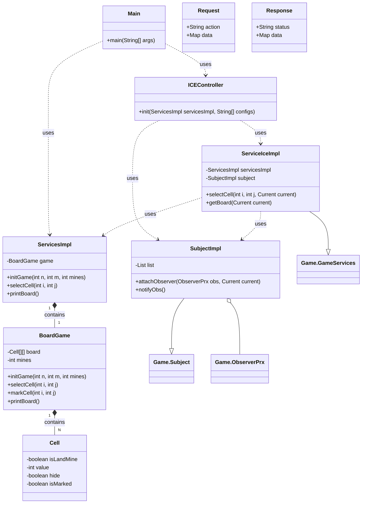

# Buscaminas

Este proyecto es una implementación del clásico juego Buscaminas, utilizando ZeroC Ice para la comunicación entre un servidor Java y un cliente web JavaScript.

[Enlace al enunciado del proyecto](https://docs.google.com/document/d/14YJsbeKYpGRnGkf0zI82eC7HODGCV6PmPLRQX491L0o/edit?usp=sharing)

## Configuración de Ice con JavaScript

A continuación, se detallan los pasos para configurar la comunicación entre el servidor y el cliente utilizando Ice.

### 1. Instalación de Dependencias

Para comenzar, es necesario instalar las dependencias de Ice y el compilador de Slice a JavaScript:

```bash
npm install ice
npm install slice2js --save-dev
```

### 2. Definición de la Interfaz (`Game.ice`)

El archivo `.ice` define las interfaces y estructuras de datos para la comunicación.

```c
module Game {

    struct CellDTO {
        bool isLandMine;
        int value;
        bool hide;
        bool showAll;
        bool isMarked;
    };

    sequence<CellDTO> PixelArray;
    sequence<PixelMatrix> PixelMatrix;

    interface GameServices {
        bool selectCell(int i, int j);
        PixelMatrix getBoard();
        void resetGame();
    };

    interface Observer {
        void notifyMessage(string hello);
    };

    interface Subject {
        void attachObserver(Observer* objs);
    };
}
```

Para generar el código JavaScript a partir de la definición de la interfaz, ejecuta el siguiente comando:

```bash
npx slice2js Game.ice
```

Esto creará los archivos `Game.js` necesarios para el cliente web. Para más información sobre la distribución de Ice para JavaScript, consulta la [documentación oficial](https://doc.zeroc.com/ice/3.7/release-notes/using-the-javascript-distribution).

### 3. Configuración del Controlador de Ice (`ICEController.java`)

En el lado del servidor, el `ICEController` inicializa el comunicador de Ice y expone los servicios. Se utiliza el protocolo de transporte `ws` (WebSocket) para la comunicación.

```java
package co.icesi.buscaminas.controllers;

import com.zeroc.Ice.Communicator;
import com.zeroc.Ice.ObjectAdapter;
import com.zeroc.Ice.Util;

import co.icesi.buscaminas.services.ServiceIceImpl;
import co.icesi.buscaminas.services.ServicesImpl;
import co.icesi.buscaminas.services.SubjectImpl;

public class ICEController {

    public void init(ServicesImpl servicesImpl, String[] configs) {
        Communicator communicator = Util.initialize(configs);
        // Se puede configurar un ThreadPool en Ice. En este caso, se define con un tamaño de 5.
        communicator.getProperties().setProperty("Ice.ThreadPool.Server.Size", "5");

        SubjectImpl imp = new SubjectImpl();
        ServiceIceImpl service = new ServiceIceImpl(servicesImpl, imp);

        ObjectAdapter adapter = communicator.createObjectAdapterWithEndpoints("IceService", "ws -h localhost -p 9099");

        adapter.add(service, Util.stringToIdentity("Service"));
        adapter.add(imp, Util.stringToIdentity("Subject"));
        adapter.activate();

        communicator.waitForShutdown();
    }
}
```

### 4. Implementación de la Interfaz `GameServices`

Esta clase implementa la lógica del juego definida en la interfaz `GameServices`.

```java
package co.icesi.buscaminas.services;

import com.zeroc.Ice.Current;

import Game.CellDTO;
import Game.GameServices;
import co.icesi.buscaminas.model.Cell;

public class ServiceIceImpl implements GameServices {

    private ServicesImpl servicesImpl;
    private SubjectImpl subject;

    public ServiceIceImpl(ServicesImpl service, SubjectImpl sub) {
        servicesImpl = service;
        subject = sub;
    }

    @Override
    public boolean selectCell(int i, int j, Current current) {
        subject.notifyObs();
        return servicesImpl.selectCell(i, j);
    }

    @Override
    public CellDTO[][] getBoard(Current current) {
        Cell[][] cells = servicesImpl.printBoard();
        CellDTO[][] dtos = new CellDTO[cells.length][cells[0].length];

        for (int i = 0; i < dtos.length; i++) {
            for (int j = 0; j < dtos[0].length; j++) {
                Cell cell = cells[i][j];
                CellDTO dto = new CellDTO(cell.isLandMine(), cell.getValue(), cell.isHide(), cell.isShowAll(),
                        cell.isMarked());
                dtos[i][j] = dto;
            }
        }
        return dtos;
    }

    @Override
    public void resetGame(Current current) {
        servicesImpl.initGame(8, 8, 10);
    }   
}
```

### 5. Implementación de la Interfaz `Subject` (Patrón Observer)

Esta implementación maneja la suscripción de observadores (clientes) para notificarles cambios en el estado del juego.

```java
package co.icesi.buscaminas.services;

import java.util.ArrayList;
import java.util.List;

import com.zeroc.Ice.Current;

import Game.ObserverPrx;
import Game.Subject;

public class SubjectImpl implements Subject {

    private List<ObserverPrx> list;

    public SubjectImpl() {
        list = new ArrayList<>();
    }

    @Override
    public void attachObserver(ObserverPrx objs, Current current) {
        System.out.println("Attach");
        System.out.println("Nuevo observer conectado: " + objs.ice_getIdentity());

        // Se asocia el proxy sobre la misma conexión abierta desde el cliente,
        // lo cual es importante en aplicaciones web para manejar conexiones bidireccionales.
        ObserverPrx proxy = objs.ice_fixed(current.con);
        list.add(proxy);

        // Se define un callback para manejar el cierre de la conexión.
        if (current.con != null) {
            current.con.setCloseCallback(connection -> {
                System.out.println("Conexión cerrada, eliminando observer: " + objs.ice_getIdentity());
                list.remove(proxy);
            });
        }
    }

    public void notifyObs() {
        System.out.println("notify: " + list.size());
        List<ObserverPrx> disconnected = new ArrayList<>();

        for (ObserverPrx prx : list) {
            try {
                prx.notifyMessage("hello");
            } catch (Exception e) {
                disconnected.add(prx);
                e.printStackTrace();
            }
        }
        list.removeAll(disconnected);
    }
}
```

Para más detalles sobre conexiones bidireccionales en Ice, puedes consultar la [documentación oficial](https://doc.zeroc.com/ice/3.7/client-server-features/connection-management/bidirectional-connections).

### 6. Implementación en el Cliente Web

#### `iceDelegate.js`

Este módulo gestiona la comunicación con el servidor Ice desde el cliente.

```javascript
import subscriber from './subscriber.js';

export class IceDelegatge {
  constructor() {
    this.communicator = Ice.initialize();
  }

  async init() {
    if (this.printer) {
      return;
    }
    const hostname = 'localhost';
    const proxy = this.communicator.stringToProxy(
      `Service:ws -h ${hostname} -p 9099`
    );
    this.printer = await Game.GameServicesPrx.checkedCast(proxy);

    const proxySubject = this.communicator.stringToProxy(
      `Subject:ws -h ${hostname} -p 9099`
    );
    this.subject = await Game.SubjectPrx.checkedCast(proxySubject);

    const adapter = await this.communicator.createObjectAdapter('');

    const conn = this.subject.ice_getCachedConnection();
    conn.setAdapter(adapter);

    const callbackPrx = Game.ObserverPrx.uncheckedCast(
      adapter.addWithUUID(subscriber)
    );

    await this.subject.attachObserver(callbackPrx);
  }

  async getBoard() {
    if (!this.printer) {
      await this.init();
    }
    return await this.printer.getBoard();
  }

  async selectCell(i, j) {
    if (!this.printer) {
      await this.init();
    }
    const resp = {};
    try {
      const win = await this.printer.selectCell(i, j);
      resp.win = win;
      resp.gameEnd = win;
    } catch (e) {
      resp.win = false;
      resp.gameEnd = true;
    }
    resp.board = await this.printer.getBoard();
    return resp;
  }

  async resetBoard() {
    if (!this.printer) {
      await this.init();
    }
    await this.printer.resetGame();
    return await this.printer.getBoard();
  }
}

const instance = new IceDelegatge();
export default instance;
```

#### `subscriber.js`

Este archivo define el objeto que recibirá las notificaciones del servidor.

```javascript
class Subscriber extends Game.Observer {
    notifyMessage(msg) {
        console.log("Mensaje del servidor: ", msg);
    }
}

export default new Subscriber();
```

### 7. Integración con HTML

Para que el cliente web funcione, es necesario incluir los scripts de Ice y de la aplicación en el archivo HTML.

```html
<!DOCTYPE html>
<html lang="en">
  <head>
    <meta charset="UTF-8" />
    <meta name="viewport" content="width=device-width, initial-scale=1.0" />
    <title>Buscaminas</title>
  </head>
  <body>
    <div id="app"></div>

    <!-- Importar los módulos de Ice y el juego -->
    <script src="./extLibs/Ice.js"></script>
    <script src="./extLibs/Game.js"></script>

    <script src="index.js" type="module"></script>
  </body>
</html>
```

### 8. Lógica de la Página del Juego (`GamePage.js`)

Este componente se encarga de renderizar el tablero y manejar las interacciones del usuario.

```javascript
import Board from '../components/Board.js';
import delegate from '../services/iceDelegate.js';

const showCell = async (cellId) => {
  const id = cellId.split('-');
  const i = parseInt(id[0]);
  const j = parseInt(id[1]);

  let data = await delegate.selectCell(i, j);

  const { win, gameEnd: end } = data;
  console.log({ win, end });

  if (end) {
    if (win) {
      alert('¡Has ganado!');
    } else {
      alert('¡Has perdido! :c');
    }
  }

  reloadBoard(data.board);
};

const reloadBoard = (boardMatrix) => {
  const container = document.getElementById('home-page');
  const oldBoard = container.querySelector('.board');
  if (oldBoard) {
    container.removeChild(oldBoard);
  }

  const board = Board(boardMatrix, showCell);
  container.appendChild(board);
};

function Game() {
  const container = document.createElement('div');
  container.id = 'home-page';

  const title = document.createElement('h1');
  title.innerText = 'Buscaminas';
  title.className = 'title';
  container.appendChild(title);

  const button = document.createElement("button");
  button.textContent = "Reiniciar";
  container.appendChild(button);

  button.onclick = async () => {
    const board = await delegate.resetBoard();
    reloadBoard(board);
  };

  delegate.getBoard().then((data) => {
    const board = Board(data, showCell);
    container.appendChild(board);
  });

  return container;
}

export default Game;
```

## Diagrama de clases de referencia:

